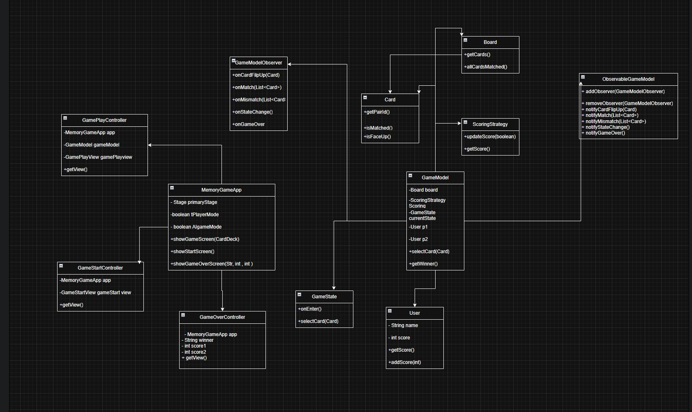

# Memory game
i have built upon the orignal memory game template by adding the following features:
- 3 new decks (emojis,pictures,numbers)
- 2 new game modes(two player, two player verus ai)
- different audio to help distinguish incorrect and correct guesses
- a high score system 
# How to run
- use cmd, get the file path and run mvn javafx:run
# UML diagrams 
The following diagram below will demonstrate the content and relationship between the important aspects of this project:
